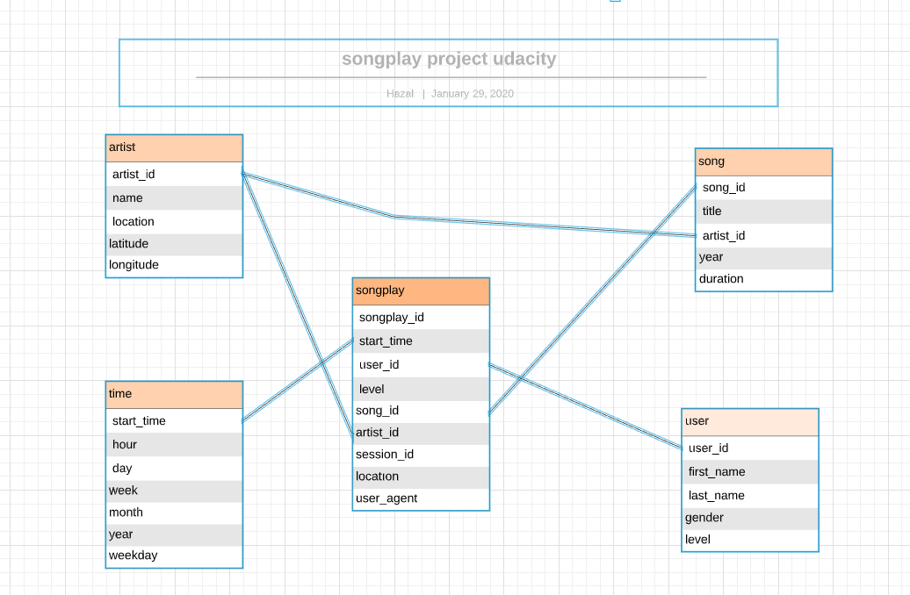

# Sparkify Data Modeling with Postgres

##### (Udacity Data Engineer Nano Degree Project 1)
---------------

**Introduction**

In this project data of Sparkify (new music streaming app). Their data is on songs and user activity and resides in a directory of JSON logs on user activity on the app, as well as a directory with JSON metadata on the songs in their app. The analytics team is particularly interested in understanding what songs users are listening to. According to their requirement, a releational data model has been created to query it easly.

**The Goal**

The purpose of this project is, data modeling with Postgres and build ETL pipeline using Python. Defining fact and dimension tables for a star schema for a particular analytic focus, and writing an ETL pipeline that transfers data from files in two local directories into these tables in Postgres using Python and SQL.

**Database & ETL pipeline**

Using the song and log datasets, star schema as shown below is created.

  - Fact Table: _songplays_
  - Dimension Tables:  _users, songs, artists, time_.

**Files in repository**

  - create_tables.py
  - etl.py
  - sql_queries.py
  - test.ipynb, etl.ipynb

**To run the program**

1. *Execute "**create_tables.py**". This will create a fresh instance of the sparkifydb with empty tables.*
2. *Execute "**etl.py**". This will load the data into the tables*

-------------

****References for README doc****

>https://dillinger.io/ \
>https://stackoverflow.com/questions/14494747/add-images-to-readme-md-on-github \
>https://github.com/adam-p/markdown-here/wiki/Markdown-Cheatsheet

